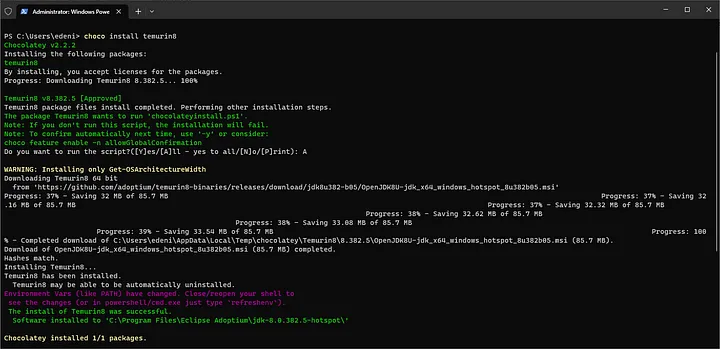
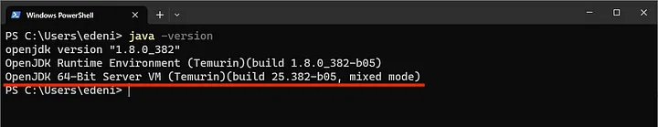
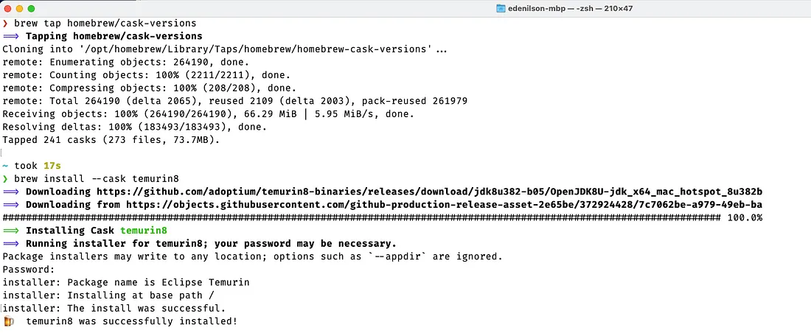

En este artículo aprenderás a instalar tanto en Windows y MacOS el JDK (Java Development Kit) el cuál es un conjunto de herramientas para poder desarrollar aplicaciones y programas con el lenguaje de programación Java.

El JDK nos brinda un entorno completo para escribir, compilar, depurar y ejecutar aplicaciones Java.

### ¿Qué distribución o plataforma de Java debo instalar? 🤔

Para que podamos crear y ejecutar nuestras aplicaciones Java, requerimos de un compilador Java, las bibliotecas de Java Runtime y una máquina virtual (JVM), el cual implementa la especificación Java Platform Standard Edition (“Java SE”).La versión “Estándar” hace referencia a las herramientas básicas requeridas para ejecutar nuestras aplicaciones escritas en Java.

Existen otro tipo de plataformas de Java, por ejemplo, **Java Enterprise Edition (JEE), Java Micro Edition (Java ME) y Java FX**, las cuales están fuera del alcance de este artículo.

### Distribuciones
Las distribuciones del código fuente del Java JDK, son proporcionadas por diferentes proveedores para una serie de plataformas compatibles (MacOS, Docker, Windows, Linux, etc).
Estas distribuciones se diferencian en cuanto a:

- Licencias.
- Soporte comercial.
- Plataformas compatibles y frecuencia de actualizaciones.

Dentro de uso más comercial encontramos la distribución de Oracle — Oracle JDK, antes, parte de la empresa Sun Microsystems, empresa que posteriormente fue adquirida por Oracle.

Otras de las distribuciones más utilizadas se encuentran OpenJDK (una alternativa Open Source), AdoptOpenJDK la cuál fue reemplazada por Adoptium Eclipse Temurin OpenJDK, entre otras.

Si quieres saber un poco más sobre qué JDK necesitas dentro de un proyecto puedes consultar el sitio web **[Which JDK](https://whichjdk.com/)**.


## Instalación 📦
Por practicidad dentro de este artículo, instalaremos la versión **OpenSource** llamada **Adoptium Eclipse Temurin OpenJDK**, la cual cuenta con soporte por la comunidad de Adoptium y es actualizada constantemente.

Para poder instalar el JDK tenemos dos alternativas:

1. A través de un administrador de paquetes en Windows conocido como **Chocolatey** y **Homebrew** para MacOS. 
    
    Los administradores de paquetes nos facilitan la instalación de programas o librerias en el sistema operativo de nuestra preferencia.

2. La segunda alternativa es a través de un proceso manual únicamente con el archivo **jar** o **.exe** proporcionado por el proveedor, la cual, es mucho más sencilla.


### Instalación en Windows
Para la instalación de la JDK en Windows, haremos uso del administrador de paquetes **Chocolatey**. Para instalar Chocolatey, ejecuta el siguiente comando como administrador en una terminal de Powershell.

```powershell
Set-ExecutionPolicy Bypass -Scope Process -Force; [System.Net.ServicePointManager]::SecurityProtocol = [System.Net.ServicePointManager]::SecurityProtocol -bor 3072; iex ((New-Object System.Net.WebClient).DownloadString('https://community.chocolatey.org/install.ps1'))
```

Espera a que la ejecución del comando finalice, si no muestra ningún mensaje de error, puedes empezar a utilizar Chocolatey 🎉.

> Puedes utilizar el comando `choco` para verificar la instalación.

> Para más información sobre chocolatey, visita la web oficial: https://chocolatey.org

Ahora, procederemos a instalar el Java Developmet Kit (Java JDK), a través de una terminal de **CMD** o **Powershell** con Permisos de Administrador, ejecuta el comando:

```sh
choco install temurin
```

Al ejecutar el comando, se mostrará un mensaje de confirmación para poder ejecutar el script de instalación, por lo que debemos confirmar escribiendo **Y** o **A** y luego **Enter** para aceptar todas las posibles opciones que el script contenga.




El mensaje `Chocolatey installed 1/1 packages` nos indica la instalación exitosa del Java JDK. :smile:

Ahora, solo nos queda verificar la instalación de la JDK mediante el comando 
```sh 
java --version
``` 



:raised_hand: En caso de mostrarse un mensaje de error como el siguiente: 

***Java is not recognized as an internal or external command, operable program or batch file***

Esto podría significar que no se instaló correctamente o el binario de java no se encuentra en las variables de entorno del sistema.


### Instalación en MacOS 
Para realizar la instalación de Java JDK haremos uso de **Homebrew**, el administrador de paquetes de MacOS. 

Para instalar **Homebrew**, ejecuta el siguiente comando en una nueva terminal:
```sh
/bin/bash -c "$(curl -fsSL https://raw.githubusercontent.com/Homebrew/install/HEAD/install.sh)"
```

Luego de instalar Homebrew, tendremos que agregar el repositorio de homebrew de terceros, el cual nos permite obtener las diferentes versiones para el paquete de temurin.

Ejecutamos el siguiente comando para agregar el repositorio:
```sh
brew tap homebrew/cask-versions
```

Mediante el siguiente comando, específicamos que instalaremos la JDK versión 1.8, si no se especifica la versión deseada, **brew instalará la última versión estable** y disponible dentro del repositorio.

```sh
brew install --cask temurin8
```

El mensaje `🍺 temurin8 was successfully installed!` nos indica que el JDK se ha instalado correctamente.

